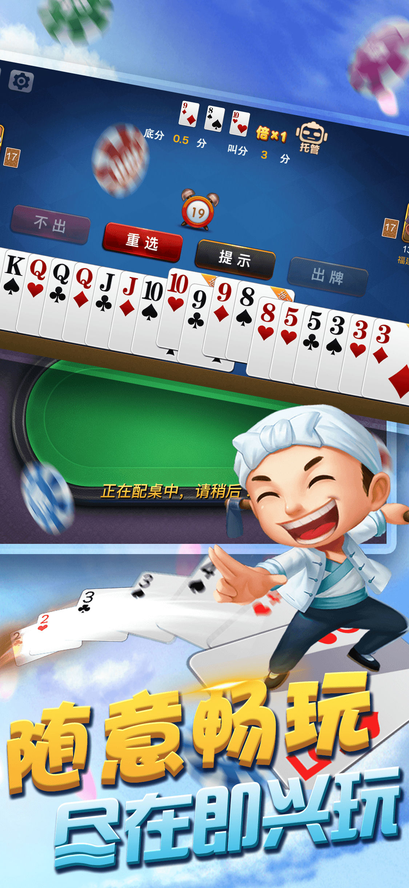

"斗"地主,是最流行的牌类游戏之一。游戏人数为三,使用一副完整的扑克牌。游戏从玩家叫地主开始,叫地主失败的玩家做农民。两个农民一起来“斗”地主。游戏中任一方先出完牌即为赢家。

即兴"斗"地主 将这一集合了思考与娱乐的游戏原汁原味地呈献给玩家,给您带来精致的游戏画面、强劲的对手与流畅的游戏体验,力求让您享受游戏的乐趣。

设计精美、大小适中的扑克牌,流畅的动画效果,效果更逼真的真人配音,水平滑动手指可以快速选择多个牌的简单操作,给您带来更好的游戏体验!

联系电话:+6009691-9001
联系邮箱:piss36nk@gmail.com